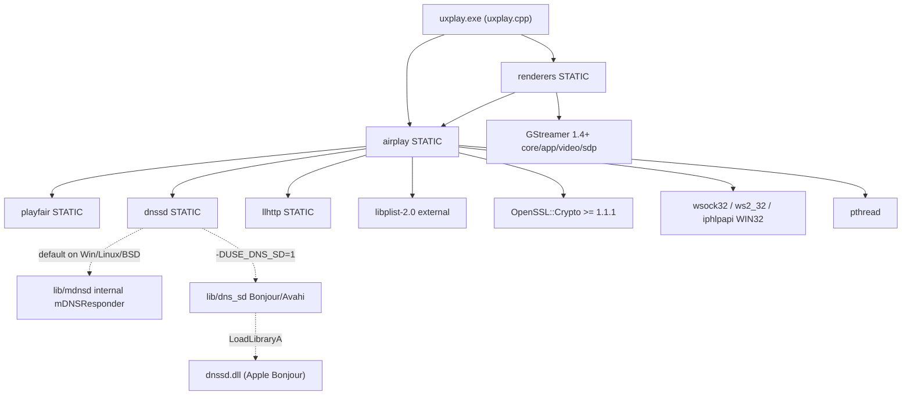
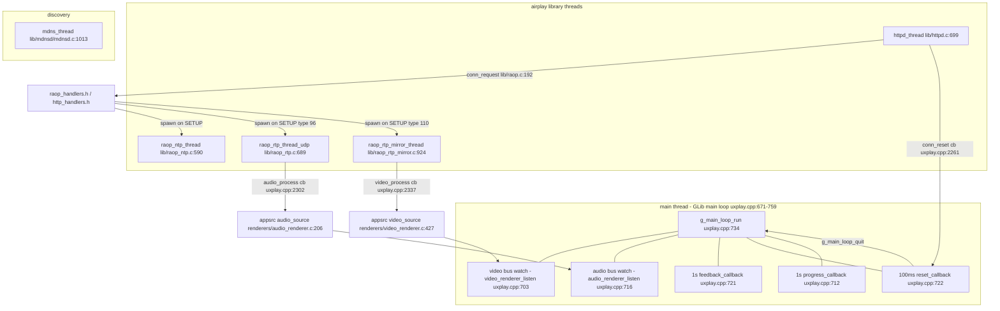
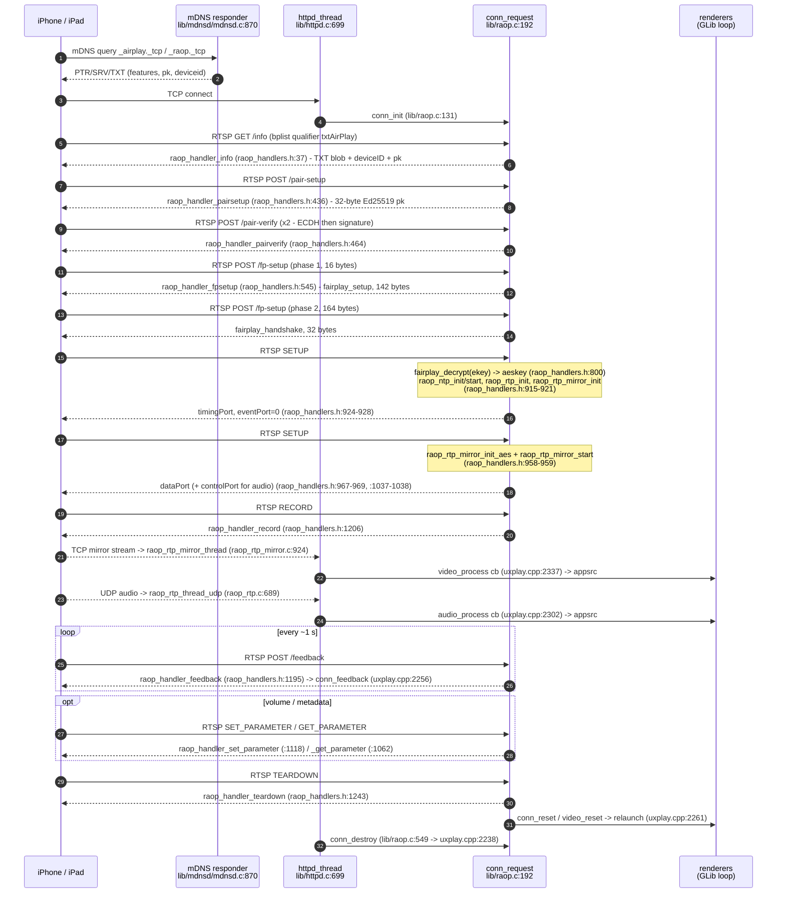

# DESIGN — Windows AirPlay Receiver on top of UxPlay

**Upstream:** [FDH2/UxPlay](https://github.com/FDH2/UxPlay), GPLv3.
**Pinned as a git submodule at** `third_party/UxPlay` @ `a3c19cbc7fcc870d74a0960bc97817a2569b4808`
(source version `1.74`, `uxplay.cpp:75`; newest upstream tag is only `v1.73.6`, so this is
unreleased 1.74 development).

**We never edit inside `third_party/UxPlay`.** Every upstream change we need lives in `patches/`.

Every claim below is cited as `file:line` relative to `third_party/UxPlay/`.
Statements I could not confirm from the source are explicitly marked **UNVERIFIED**.
Companion document: [`docs/research/uxplay-source-map.md`](research/uxplay-source-map.md).

---

## 1. Architecture overview

### 1.1 Components

UxPlay is four static libraries plus one monolithic application file.

| Component | Built as | Source | Purpose |
|---|---|---|---|
| `airplay` | STATIC lib (`lib/CMakeLists.txt:59-61`) | `lib/*.c` | The whole AirPlay/RAOP protocol: RTSP+HTTP server, pairing, FairPlay, RTP receivers, DNS-SD façade |
| `dnssd` | STATIC lib | **either** `lib/dns_sd/` (`lib/dns_sd/CMakeLists.txt:4-6`) **or** `lib/mdnsd/` (`lib/mdnsd/CMakeLists.txt:4-6`) | Service discovery. Both build a library literally named `dnssd`, so `lib/dnssd.h` is a stable façade |
| `llhttp` | STATIC lib (`lib/llhttp/CMakeLists.txt:4-6`) | vendored llhttp (MIT), `lib/llhttp/LICENSE-MIT` | HTTP/RTSP message parser used by `lib/http_request.c` |
| `playfair` | STATIC lib (`lib/playfair/CMakeLists.txt:4-6`) | `lib/playfair/*.c` | FairPlay SAP key exchange; single public symbol `playfair_decrypt` (`lib/playfair/playfair.h:4`) |
| `renderers` | STATIC lib (`renderers/CMakeLists.txt:48-52`) | `renderers/{audio,video,mux}_renderer.c` | GStreamer pipelines for audio, video and file muxing |
| `uxplay` | executable (`CMakeLists.txt:81`) | `uxplay.cpp` (~3400 lines) | CLI parsing, callback implementations, GLib main loop, restart policy |

**`plist` is not a UxPlay library** — it is the external `libplist-2.0`, found via pkg-config
(`lib/CMakeLists.txt:95-97` on Windows, `:99-104` elsewhere) and used for the binary-plist bodies of
`GET /info`, `SETUP`, `/pair-setup`, etc.

Link graph (`CMakeLists.txt:81-85`, `lib/CMakeLists.txt:69-105,137-145`, `renderers/CMakeLists.txt:48-54,89`):



Backend selection is `CMakeLists.txt:51-69`:
`if (USE_DNS_SD OR (APPLE AND NOT USE_MDNS)) → lib/dns_sd, else → lib/mdnsd`.

### 1.2 Internal structure of `airplay`

| Layer | Files | Entry points |
|---|---|---|
| Server object | `lib/raop.c`, `lib/raop.h` | `raop_init` (`lib/raop.c:586`), `raop_init2` (`:653`), `raop_start_httpd` (`:834`), `raop_destroy` (`:701`) |
| TCP listener / connection table | `lib/httpd.c`, `lib/httpd.h` | `httpd_init` (`lib/httpd.h:50`), `httpd_start` (`:54`) |
| Message parsing | `lib/http_request.c`, `lib/http_response.c` (over `lib/llhttp/`) | `http_request_get_method/_url/_header/_data` |
| RTSP handlers | `lib/raop_handlers.h` (static funcs in a header, included by `raop.c`) | see §3 |
| HTTP handlers | `lib/http_handlers.h` | see §3 |
| Pairing / crypto | `lib/pairing.c`, `lib/srp.c`, `lib/crypto.c` | `pairing_init_generate` (`lib/pairing.h:39`), `pairing_session_handshake` (`:45`) |
| FairPlay | `lib/fairplay_playfair.c` + `lib/playfair/` | `fairplay_setup` (`lib/fairplay.h:23`), `fairplay_handshake` (`:24`), `fairplay_decrypt` (`:25`) |
| Audio RTP | `lib/raop_rtp.c`, `lib/raop_buffer.c` | `raop_rtp_init` (`lib/raop_rtp.h:32`), `raop_rtp_start_audio` (`:35`) |
| Mirror video TCP | `lib/raop_rtp_mirror.c`, `lib/mirror_buffer.c` | `raop_rtp_mirror_init` (`lib/raop_rtp_mirror.h:28`), `raop_rtp_mirror_start` (`:31`) |
| Clock sync | `lib/raop_ntp.c` | `raop_ntp_start` (`lib/raop_ntp.h:47`), `ntp_global_init` (`lib/raop.h:123`) |
| HLS / AirPlay-video | `lib/airplay_video.c`, `lib/fcup_request.h` | `airplay_video_init` (`lib/raop.h:120`) — **out of scope for us** |
| Discovery façade | `lib/dnssd.c`, `lib/dnssd.h`, `lib/dnssdint.h` | see §2 |
| Portability | `lib/compat.h`, `lib/sockets.h`, `lib/threads.h`, `lib/netutils.c` | `netutils_init` (called from `lib/raop.c:590`) |

### 1.3 Runtime thread / main-loop model

There are exactly five `THREAD_CREATE` sites in the whole tree:

| Thread | Created at | Lifetime |
|---|---|---|
| mDNS responder | `lib/mdnsd/mdnsd.c:1013` (`mdns_thread`, `:870`) | from `mdnsd_start`, i.e. the first `dnssd_register_*` |
| HTTP/RTSP accept loop | `lib/httpd.c:699` (`httpd_thread`) | from `httpd_start` / `raop_start_httpd` |
| NTP timing | `lib/raop_ntp.c:590` | per connection, from `SETUP` #1 |
| Audio RTP (UDP) | `lib/raop_rtp.c:689` | per audio stream, from `SETUP` #2 type 96 |
| Mirror video (TCP) | `lib/raop_rtp_mirror.c:924` | per mirror stream, from `SETUP` #2 type 110 |

Rendering happens on the **GLib main loop thread** (`uxplay.cpp:671-759`); the receiver threads only
push buffers into GStreamer `appsrc` elements.



**Restart mechanism:** `conn_reset` (`uxplay.cpp:2261`) sets `reset_httpd` / `relaunch_video` /
`reset_loop` (`:2276-2278`); the 100 ms `reset_callback` quits the loop; `main()` then destroys and
re-creates the video renderer with the same option strings (`uxplay.cpp:3286-3297`) and jumps back
via `goto reconnect` (`:3274`, `:3307`). **There is no re-entrant "restart" API** — this is
application-level control flow.

---

## 2. Discovery

### 2.1 The two services

Both are advertised on **the same TCP port** — `airplay_port = raop_port` (`uxplay.cpp:2768`).

| Service | Instance name | Registered by |
|---|---|---|
| `_airplay._tcp` | `<friendly name>` | `dnssd_register_airplay` — `lib/mdnsd/dnssd_mdnsd.c:265` / `lib/dns_sd/dns_sd.c:312` (type string at `dns_sd.c:359`, `dnssd_mdnsd.c:174`) |
| `_raop._tcp` | `<MAC-hex>@<friendly name>` | `dnssd_register_raop` — `lib/mdnsd/dnssd_mdnsd.c:239` / `lib/dns_sd/dns_sd.c:233` (name built at `dnssd_mdnsd.c:82-85`, `dns_sd.c:285-297`; type at `dns_sd.c:301`, `dnssd_mdnsd.c:184`) |

Internal responder details: multicast group `224.0.0.251` (`lib/mdnsd/mdnsd.c:28`), UDP port `5353`
(`:30`), service TTL `4500` s (`lib/mdnsd/mdnsd.h:22`), host name from `gethostname()` sanitised to
`<host>.local` (`lib/mdnsd/dnssd_mdnsd.c:62-72`). Goodbye packets on unregister
(`lib/mdnsd/dnssd_mdnsd.c:321`, `:341`).

### 2.2 `_raop._tcp` TXT record — every field and its source

| Key | Value | Constant | Written at (mdnsd / dns_sd) |
|---|---|---|---|
| `txtvers` | `1` | `RAOP_TXTVERS` `lib/dnssdint.h:27` | `dnssd_mdnsd.c:137` / `dns_sd.c:279` |
| `ch` | `2` (audio channels) | `RAOP_CH` `lib/dnssdint.h:28` | `:123` / `:249` |
| `cn` | `0,1,2,3` (PCM, ALAC, AAC, AAC-ELD) | `RAOP_CN` `lib/dnssdint.h:29` | `:124` / `:250` |
| `et` | `0,3,5` (None, FairPlay, FairPlay SAPv2.5) | `RAOP_ET` `lib/dnssdint.h:30` | `:126` / `:252` |
| `da` | `true` | `RAOP_DA` `lib/dnssdint.h:38` | `:125` / `:251` |
| `vv` | `2` | `RAOP_VV` `lib/dnssdint.h:31` | `:127` / `:253` |
| `ft` | `0x%X,0x%X` of `features1,features2` | computed, see §2.5 | `:120,128` / `:246,254` |
| `am` | `AppleTV3,2` | `GLOBAL_MODEL` `lib/global.h:21` | `:129` / `:255` |
| `md` | `0,1,2` (text, artwork, progress) | `RAOP_MD` `lib/dnssdint.h:43` | `:130` / `:256` |
| `rhd` | `5.6.0.0` | `RAOP_RHD` `lib/dnssdint.h:35` | `:131` / `:257` |
| `pw` | `false`, or `true` when a pin/password is set | runtime `pin_pw` | `:103,132` / `:261,267,271` |
| `sf` | `0x4` default; `0x8c` for `-pin`; `0x84` for `-pw` | `RAOP_SF` `lib/dnssdint.h:36` | `:104-118,138` / `:262,268,272` |
| `sr` | `44100` | `RAOP_SR` `lib/dnssdint.h:39` | `:133` / `:275` |
| `ss` | `16` | `RAOP_SS` `lib/dnssdint.h:40` | `:134` / `:276` |
| `sv` | `false` | `RAOP_SV` `lib/dnssdint.h:37` | `:135` / `:277` |
| `tp` | `UDP` | `RAOP_TP` `lib/dnssdint.h:42` | `:136` / `:278` |
| `vs` | `220.68` | `RAOP_VS` = `GLOBAL_VERSION` `lib/global.h:22` | `:139` / `:280` |
| `vn` | `65537` | `RAOP_VN` `lib/dnssdint.h:44` | `:140` / `:281` |
| `pk` | per-install Ed25519 public key, hex | `raop->pk_str`, `lib/raop.c:664-674` | `:141` / `:282` |

`sf` semantics are documented inline: bit 3 (`0x08`) = "pin required", bit 7 (`0x80`) =
"password required" (`lib/dns_sd/dns_sd.c:260`, `:266`).

### 2.3 `_airplay._tcp` TXT record

| Key | Value | Source | Written at (mdnsd / dns_sd) |
|---|---|---|---|
| `deviceid` | MAC as `AA:BB:CC:DD:EE:FF` | `utils_hwaddr_airplay` | `dnssd_mdnsd.c:160` / `dns_sd.c:334` |
| `features` | `0x%X,0x%X` — same value as `_raop` `ft` | §2.5 | `:161` / `:335` |
| `pw` | `true` when pin/password is set, else `false` | runtime | `:162` / `:338,343,347` |
| `flags` | **hardcoded `0x4` in both backends** | — | `:163` / `:339,344,348` |
| `model` | `AppleTV3,2` | `GLOBAL_MODEL` `lib/global.h:21` | `:164` / `:351` |
| `pk` | Ed25519 public key, hex | `lib/raop.c:664-674` | `:165` / `:352` |
| `pi` | `2e388006-13ba-4041-9a67-25dd4a43d536` | `AIRPLAY_PI` `lib/dnssdint.h:49` | `:166` / `:353` |
| `srcvers` | `220.68` | `AIRPLAY_SRCVERS` `lib/dnssdint.h:46` | `:167` / `:354` |
| `vv` | `2` | `AIRPLAY_VV` `lib/dnssdint.h:48` | `:168` / `:355` |

> **Trap:** `AIRPLAY_FLAGS "0x84"` is defined at `lib/dnssdint.h:47` but **never used** — both
> backends write the literal `"0x4"`. Do not copy the constant.

The same TXT byte blobs are re-served over HTTP by `GET /info` via `dnssd_get_airplay_txt` /
`dnssd_get_raop_txt` (`lib/raop_handlers.h:97`, `:103`), which is how Bluetooth-LE-beacon discovery
works without mDNS at all.

### 2.4 Ports

| Role | Default | Legacy (`-p` with no argument) | Set at |
|---|---|---|---|
| RTSP/HTTP server (both services) | **dynamic** (`raop->port = 0`, `lib/raop.c:613`; socket bound in `httpd_start`, `lib/httpd.c:668,674`) | TCP 7100 / 7000 / 7001 | `uxplay.cpp:1336` |
| UDP timing / control / data | dynamic (`lib/raop.c:614-616`) | UDP 7011 / 6001 / 6000 | `uxplay.cpp:1337` |
| Mirror video data (TCP) | dynamic (`raop->mirror_data_lport`, `lib/raop.c:617`) | — | reported back to the client as `dataPort` (`lib/raop_handlers.h:967-969`) |
| mDNS | UDP 5353, fixed | — | `lib/mdnsd/mdnsd.c:30` |

`-p` forms (`uxplay.cpp:947-950`, parsed at `:1334-1352`): bare `-p` = legacy ports; `-p n` =
`n, n+1, n+2`; `-p n1,n2,n3`; `-p tcp n` / `-p udp n` set one family. Range check
`LOWEST_ALLOWED_PORT` 1024 … `HIGHEST_PORT` 65535 (`uxplay.cpp:81-82`). When set, UxPlay prints
`using network ports UDP %d %d %d TCP %d %d %d` (`uxplay.cpp:3205`).
Ports reach the library via `raop_set_tcp_ports` / `raop_set_udp_ports` (`uxplay.cpp:2760-2761`).

### 2.5 The features bitmask

Seeded from `lib/dnssdint.h:32-34`:

```c
#define FEATURES_1 "0x5A7FFEE6" /* first 32 bits of features, with bit 27 ("supports legacy pairing") ON */
//#define FEATURES_1 "0x527FFEE6" /* first 32 bits of features, with bit 27 ("supports legacy pairing") OFF */
#define FEATURES_2  "0x0"        /* second 32 bits of features */
```

parsed into `dnssd->features1/2` at `lib/dnssd.c:64-79` (struct fields `lib/dnssd.h:45-46`),
mutated bit-by-bit by `dnssd_set_airplay_features` (`lib/dnssd.c:155-172`), recombined by
`dnssd_get_airplay_features` (`lib/dnssd.c:145-149`).

**But the seed is immediately overwritten.** `uxplay.cpp:1997-1999` says so explicitly
("after dnssd starts, reset the default feature set here / (overwrites features set in dnssdint.h)"),
and `uxplay.cpp:2001-2092` — reproduced **verbatim** below — rewrites every bit of the low word:

```c
    dnssd_set_airplay_features(dnssd,  0, 0); // AirPlay video supported 
    dnssd_set_airplay_features(dnssd,  1, 1); // photo supported 
    dnssd_set_airplay_features(dnssd,  2, 1); // video protected with FairPlay DRM 
    dnssd_set_airplay_features(dnssd,  3, 0); // volume control supported for videos

    dnssd_set_airplay_features(dnssd,  4, 0); // http live streaming (HLS) supported
    dnssd_set_airplay_features(dnssd,  5, 1); // slideshow supported 
    dnssd_set_airplay_features(dnssd,  6, 1); // 
    dnssd_set_airplay_features(dnssd,  7, 1); // mirroring supported

    dnssd_set_airplay_features(dnssd,  8, 0); // screen rotation  supported 
    dnssd_set_airplay_features(dnssd,  9, 1); // audio supported 
    dnssd_set_airplay_features(dnssd, 10, 1); //  
    dnssd_set_airplay_features(dnssd, 11, 1); // audio packet redundancy supported

    dnssd_set_airplay_features(dnssd, 12, 1); // FaiPlay secure auth supported 
    dnssd_set_airplay_features(dnssd, 13, 1); // photo preloading  supported 
    dnssd_set_airplay_features(dnssd, 14, 1); // Authentication bit 4:  FairPlay authentication
    dnssd_set_airplay_features(dnssd, 15, 1); // Metadata bit 1 support:   Artwork 

    dnssd_set_airplay_features(dnssd, 16, 1); // Metadata bit 2 support:  Soundtrack  Progress 
    dnssd_set_airplay_features(dnssd, 17, 1); // Metadata bit 0 support:  Text (DAACP) "Now Playing" info.
    dnssd_set_airplay_features(dnssd, 18, 1); // Audio format 1 support:   
    dnssd_set_airplay_features(dnssd, 19, 1); // Audio format 2 support: must be set for AirPlay 2 multiroom audio 

    dnssd_set_airplay_features(dnssd, 20, 1); // Audio format 3 support: must be set for AirPlay 2 multiroom audio 
    dnssd_set_airplay_features(dnssd, 21, 1); // Audio format 4 support:
    dnssd_set_airplay_features(dnssd, 22, 1); // Authentication type 4: FairPlay authentication
    dnssd_set_airplay_features(dnssd, 23, 0); // Authentication type 1: RSA Authentication

    dnssd_set_airplay_features(dnssd, 24, 0); // 
    dnssd_set_airplay_features(dnssd, 25, 1); // 
    dnssd_set_airplay_features(dnssd, 26, 0); // Has Unified Advertiser info
    dnssd_set_airplay_features(dnssd, 27, 1); // Supports Legacy Pairing

    dnssd_set_airplay_features(dnssd, 28, 1); //  
    dnssd_set_airplay_features(dnssd, 29, 0); // 
    dnssd_set_airplay_features(dnssd, 30, 1); // RAOP support: with this bit set, the AirTunes service is not required. 
    dnssd_set_airplay_features(dnssd, 31, 0); // 


    /*  bits 32-63: see  https://emanualcozzi.net/docs/airplay2/features 
    dnssd_set_airplay_features(dnssd, 32, 0); // isCarPlay when ON,; Supports InitialVolume when OFF
    dnssd_set_airplay_features(dnssd, 33, 0); // Supports Air Play Video Play Queue
    dnssd_set_airplay_features(dnssd, 34, 0); // Supports Air Play from cloud (requires that bit 6 is ON)
    dnssd_set_airplay_features(dnssd, 35, 0); // Supports TLS_PSK

    dnssd_set_airplay_features(dnssd, 36, 0); //
    dnssd_set_airplay_features(dnssd, 37, 0); //
    dnssd_set_airplay_features(dnssd, 38, 0); //  Supports Unified Media Control (CoreUtils Pairing and Encryption)
    dnssd_set_airplay_features(dnssd, 39, 0); //

    dnssd_set_airplay_features(dnssd, 40, 0); // Supports Buffered Audio
    dnssd_set_airplay_features(dnssd, 41, 0); // Supports PTP
    dnssd_set_airplay_features(dnssd, 42, 0); // Supports Screen Multi Codec (allows h265 video)
    dnssd_set_airplay_features(dnssd, 43, 0); // Supports System Pairing

    dnssd_set_airplay_features(dnssd, 44, 0); // is AP Valeria Screen Sender
    dnssd_set_airplay_features(dnssd, 45, 0); //
    dnssd_set_airplay_features(dnssd, 46, 0); // Supports HomeKit Pairing and Access Control
    dnssd_set_airplay_features(dnssd, 47, 0); //

    dnssd_set_airplay_features(dnssd, 48, 0); // Supports CoreUtils Pairing and Encryption
    dnssd_set_airplay_features(dnssd, 49, 0); //
    dnssd_set_airplay_features(dnssd, 50, 0); // Metadata bit 3: "Now Playing" info sent by bplist not DAACP test
    dnssd_set_airplay_features(dnssd, 51, 0); // Supports Unified Pair Setup and MFi Authentication

    dnssd_set_airplay_features(dnssd, 52, 0); // Supports Set Peers Extended Message
    dnssd_set_airplay_features(dnssd, 53, 0); //
    dnssd_set_airplay_features(dnssd, 54, 0); // Supports AP Sync
    dnssd_set_airplay_features(dnssd, 55, 0); // Supports WoL

    dnssd_set_airplay_features(dnssd, 56, 0); // Supports Wol
    dnssd_set_airplay_features(dnssd, 57, 0); //
    dnssd_set_airplay_features(dnssd, 58, 0); // Supports Hangdog Remote Control
    dnssd_set_airplay_features(dnssd, 59, 0); // Supports AudioStreamConnection setup

    dnssd_set_airplay_features(dnssd, 60, 0); // Supports Audo Media Data Control         
    dnssd_set_airplay_features(dnssd, 61, 0); // Supports RFC2198 redundancy
    */

    /* needed for HLS video support */
    dnssd_set_airplay_features(dnssd, 0, (int) hls_support);
    dnssd_set_airplay_features(dnssd, 4, (int) hls_support);
    // not sure about this one (bit 8, screen rotation supported):
    //dnssd_set_airplay_features(dnssd, 8, (int) hls_support);
    
    /* needed for h265 video support */
    dnssd_set_airplay_features(dnssd, 42, (int) h265_support);

    /* bit 27 of Features determines whether the AirPlay2 client-pairing protocol will be used (1) or not (0) */
    dnssd_set_airplay_features(dnssd, 27, (int) setup_legacy_pairing);
```

#### Meaningful bits (low word)

Comments in the table are UxPlay's own, from the block above. Bits with an empty `//` comment
upstream are marked **UNVERIFIED** — I will not guess their meaning.

| Bit | Value at runtime | Meaning (upstream comment) | Set at |
|---|---|---|---|
| 0 | `hls_support` (default 0) | AirPlay video supported | `uxplay.cpp:2001`, overridden `:2083` |
| 1 | 1 | photo supported | `:2002` |
| 2 | 1 | video protected with FairPlay DRM | `:2003` |
| 3 | 0 | volume control supported for videos | `:2004` |
| 4 | `hls_support` (default 0) | HTTP Live Streaming (HLS) supported | `:2006`, overridden `:2084` |
| 5 | 1 | slideshow supported | `:2007` |
| 6 | 1 | **UNVERIFIED** (no upstream comment) | `:2008` |
| 7 | 1 | **mirroring supported** — required for our use case | `:2009` |
| 8 | 0 | screen rotation supported | `:2011` |
| 9 | 1 | audio supported | `:2012` |
| 10 | 1 | **UNVERIFIED** | `:2013` |
| 11 | 1 | audio packet redundancy supported | `:2014` |
| 12 | 1 | FairPlay secure auth supported | `:2016` |
| 13 | 1 | photo preloading supported | `:2017` |
| 14 | 1 | Authentication bit 4: FairPlay authentication | `:2018` |
| 15 | 1 | Metadata bit 1: Artwork | `:2019` |
| 16 | 1 | Metadata bit 2: Soundtrack Progress | `:2021` |
| 17 | 1 | Metadata bit 0: Text (DAAP) "Now Playing" | `:2022` |
| 18 | 1 | Audio format 1 support | `:2023` |
| 19 | 1 | Audio format 2 support (needed for AirPlay 2 multiroom) | `:2024` |
| 20 | 1 | Audio format 3 support (needed for AirPlay 2 multiroom) | `:2026` |
| 21 | 1 | Audio format 4 support | `:2027` |
| 22 | 1 | Authentication type 4: FairPlay authentication | `:2028` |
| 23 | 0 | Authentication type 1: RSA authentication | `:2029` |
| 24 | 0 | **UNVERIFIED** | `:2031` |
| 25 | 1 | **UNVERIFIED** | `:2032` |
| 26 | 0 | Has Unified Advertiser info | `:2033` |
| 27 | `setup_legacy_pairing` (default **0**) | Supports Legacy Pairing — selects the AirPlay 2 client-pairing protocol | `:2034`, overridden `:2092` |
| 28 | 1 | **UNVERIFIED** | `:2036` |
| 29 | 0 | **UNVERIFIED** | `:2037` |
| 30 | 1 | RAOP support: with this bit set the AirTunes service is not required | `:2038` |
| 31 | 0 | **UNVERIFIED** | `:2039` |

High word (bits 32-63) is entirely `0` except:

| Bit | Value | Meaning | Set at |
|---|---|---|---|
| 42 | `h265_support` (default 0) | Supports Screen Multi Codec (allows h265/HEVC video) | `uxplay.cpp:2089` |

All other high-word bits are only present as a **commented-out** reference block
(`uxplay.cpp:2042-2080`) and are therefore left at `0` from `FEATURES_2 "0x0"`.

#### Effective default value

`setup_legacy_pairing` defaults to `false` (`uxplay.cpp:161`) and is only turned on by `-pin`
(`uxplay.cpp:1613`); `-pw` turns it back off (`:1652`). Summing the table above with
`hls_support = h265_support = setup_legacy_pairing = 0` gives:

- bits 1,2 → `0x6`; bits 5-7 → `0xE0`  ⇒ low byte `0xE6`
- bits 9-15 → `0xFE00`  ⇒ `0xFEE6`
- bits 16-22 → `0x7F0000`; bit 25 → `0x2000000`; bit 28 → `0x10000000`; bit 30 → `0x40000000`

**⇒ default advertised `features` = `0x527FFEE6,0x0`**, i.e. exactly the *commented-out*
`FEATURES_1` at `lib/dnssdint.h:33`, **not** the active `0x5A7FFEE6` at `:32`.
With `-pin`, bit 27 turns on and it becomes `0x5A7FFEE6,0x0`.
UxPlay logs the effective value at `uxplay.cpp:1956-1957`:
`register_dnssd: advertised AirPlay service with "Features" code = 0x%llX` (DEBUG level, needs `-d`).

**Design decision:** our app must reproduce `uxplay.cpp:2001-2092`, not `lib/dnssdint.h`.

---

## 3. Session flow — screen mirroring

### 3.1 Sequence



### 3.2 Step-by-step, with handler + dispatch citation

Dispatch table for RTSP/1.0 is `lib/raop.c:406-444`; for HTTP/1.1 it is `lib/raop.c:445-478`.

| # | Request | Dispatched at | Handler | Needed for plain mirroring? |
|---|---|---|---|---|
| 1 | `GET /info` | `lib/raop.c:425` | `raop_handler_info` `lib/raop_handlers.h:37` | **Yes** |
| 2 | `POST /pair-setup` | `lib/raop.c:415` | `raop_handler_pairsetup` `lib/raop_handlers.h:436` | **Yes** |
| 3 | `POST /pair-verify` | `lib/raop.c:417` | `raop_handler_pairverify` `lib/raop_handlers.h:464` | **Yes** |
| 4 | `POST /fp-setup` | `lib/raop.c:419` | `raop_handler_fpsetup` `lib/raop_handlers.h:545` | **Yes** — see §3.3 |
| 5 | `OPTIONS` | `lib/raop.c:428` | `raop_handler_options` `lib/raop_handlers.h:585` | Optional; advertises `Public: SETUP, RECORD, FLUSH, TEARDOWN, OPTIONS, GET_PARAMETER, SET_PARAMETER` (`:589`) |
| 6 | `SETUP` #1 (`ekey`+`eiv`) | `lib/raop.c:431` | `raop_handler_setup` `lib/raop_handlers.h:593`, branch at `:626` ("The first SETUP call that initializes keys and timing", `:627`) | **Yes** |
| 7 | `SETUP` #2 (`streams` array) | same handler, branch `lib/raop_handlers.h:934-935` | type `110` = mirroring (`:947`), type `96` = audio (`:975`); unknown types logged at `:1046` | **Yes** (110; 96 only if audio wanted) |
| 8 | `RECORD` | `lib/raop.c:437` | `raop_handler_record` `lib/raop_handlers.h:1206` | **Yes** |
| 9 | `POST /feedback` | `lib/raop.c:409` | `raop_handler_feedback` `lib/raop_handlers.h:1195` → `conn_feedback` (`uxplay.cpp:2256`) | **Yes** — missing it for `-reset n` seconds triggers a forced reset (`uxplay.cpp:538-540`, limit `MISSED_FEEDBACK_LIMIT` = 15, `:83`) |
| 10 | `SET_PARAMETER` | `lib/raop.c:435` | `raop_handler_set_parameter` `lib/raop_handlers.h:1118` — volume, progress (`:1149`), coverart (`:1161`), metadata (`:1168`) | Optional |
| 11 | `GET_PARAMETER` | `lib/raop.c:433` | `raop_handler_get_parameter` `lib/raop_handlers.h:1062` | Optional (volume query) |
| 12 | `FLUSH` | `lib/raop.c:439` | `raop_handler_flush` `lib/raop_handlers.h:1220` | Audio only |
| 13 | `TEARDOWN` | `lib/raop.c:441` | `raop_handler_teardown` `lib/raop_handlers.h:1243`; parses `streams` (`:1255`), logs `teardown_96` / `teardown_110` (`:1272`) | **Yes** |
| 14 | `POST /audioMode` | `lib/raop.c:421` | `raop_handler_audiomode` `lib/raop_handlers.h:1174` | No |

Connection lifecycle around all of this: `conn_init` (`lib/raop.c:131`) → `conn_request`
(`lib/raop.c:192`) → `conn_destroy` (`lib/raop.c:549`), installed as `httpd_callbacks_t` in
`raop_init2` (`lib/raop.c:680-688`).

> **There is no `/audio` endpoint.** Audio never travels over HTTP: it arrives on the UDP data port
> negotiated by `SETUP` stream type 96 (`lib/raop_handlers.h:975-1038`) and is handled by
> `raop_rtp_thread_udp` (`lib/raop_rtp.c:689`). The only `/audio*` URL in the tree is
> `/audioMode` (`lib/raop.c:420`).

### 3.3 What plain mirroring needs vs. what is out of scope

**Required for screen mirroring** (our target):
- mDNS advertisement of both services with bit 7 (mirroring) set — §2.
- `GET /info`, `/pair-setup`, `/pair-verify`, `SETUP` ×2, `RECORD`, `/feedback`, `TEARDOWN`.
- **`/fp-setup` is required, not optional.** The `ekey` sent in `SETUP` #1 is FairPlay-encrypted and
  is turned into the 16-byte AES key by `fairplay_decrypt` (`lib/raop_handlers.h:800`), using state
  established by the two `/fp-setup` phases (`lib/fairplay.h:23-25`). Without it there is no video key.
  Note that on newer clients the AES key is additionally SHA-256-hashed with the pair-verify ECDH
  secret (`lib/raop_handlers.h:822-849`).
- `_raop` TXT `et=0,3,5` (`lib/dnssdint.h:30`) is what advertises FairPlay availability.

**Out of scope for milestone 1 & 2** (present in UxPlay, we will not exercise it):
- **HLS / AirPlay-video**: all of `lib/http_handlers.h` (`/play`, `/scrub?`, `/rate?`, `/stop`,
  `/action`, `/getProperty?`, `/setProperty?`, `/server-info`, `/playback-info`, `/reverse`,
  `http_handler_hls`), `lib/airplay_video.c`, feature bits 0 and 4, the `-hls` option
  (`uxplay.cpp:1729`), and the `playbin`/`playbin3` renderer branch
  (`renderers/video_renderer.c:317-320`). UxPlay explicitly refuses these without `-hls`
  (`lib/raop.c:264`).
- **Pin / password pairing**: `/pair-pin-start` (`lib/raop.c:411`), `/pair-setup-pin` (`:413`),
  SRP (`lib/srp.c`), `-pin` / `-pw` / `-reg`. Nice-to-have later; not needed for a first connection.
- **DACP remote control** (`export_dacp`, `uxplay.cpp:2220`), **coverart/metadata rendering**,
  **`-mp4` muxing** (`renderers/mux_renderer.c`), **Bluetooth-LE beacon discovery**
  (`uxplay.cpp:3256-3267`), **D-Bus screensaver inhibition** (Linux only, `CMakeLists.txt:30-42`).
- **`eventPort` is always 0** in mirror/audio mode — "the event port is not used in mirror mode or
  audio mode" (`lib/raop_handlers.h:923-924`), so no reverse event channel is negotiated.

---

## 4. Media path

### 4.1 Mirror video: from TCP bytes to GStreamer

The mirror stream is a **TCP** connection (not RTP-over-UDP), read by `raop_rtp_mirror_thread`
(`lib/raop_rtp_mirror.c:924`). Each packet has a 128-byte header; the payload type is
`packet[4]` / `packet[5]` and is documented inline at `lib/raop_rtp_mirror.c:338-343`:

| `packet[4]` | Meaning | Branch |
|---|---|---|
| `0x00` | encrypted VCL NAL (type 1 non-IDR, or type 5 IDR when `packet[5]==0x10`) | `lib/raop_rtp_mirror.c:388-389` |
| `0x01` | **unencrypted SPS + PPS packet**, also carries image-size data in `packet[16:127]` | `:555`, comment `:360` |
| `0x02` | old-protocol keepalive, no payload, once per second | `:775` |
| `0x05` | client "streaming report", once per second (surfaced by `-FPSdata`) | `:780` |

**SPS/PPS handling** (`lib/raop_rtp_mirror.c:182-184`, `:353-358`, `:425-447`):
SPS/PPS arrive *unencrypted* in their own packet, initially and whenever the video format changes.
UxPlay does **not** push them separately — it sets `prepend_sps_pps = true`, stores the bytes in
`sps_pps`, and prepends them to the *next* encrypted packet, which carries the same NTP timestamp and
is (almost always) the IDR. A timestamp mismatch causes the stored SPS/PPS to be discarded with a
warning (`:425-432`). This exists because M1/M2 Mac clients prepend a type-6 SEI NAL to the IDR
(`:356-357`, `:417-419`).

The same `0x01` packet is where **resolution** and **codec** are discovered:
- `width_source` / `height_source` floats at `packet[16..23]` and duplicated at `packet[40..47]`
  (`lib/raop_rtp_mirror.c:558-562`, `:593-594`), reported through the `video_report_size` callback
  (`:606` → `uxplay.cpp:2483`).
- h265 vs h264 is decided at `lib/raop_rtp_mirror.c:629` / `:708` and pushed through
  `video_set_codec` (`:630`, `:709` → `uxplay.cpp:2185`), which selects the matching pipeline via
  `video_renderer_choose_codec` (`renderers/video_renderer.h:74`).

**NAL length-prefix → Annex-B conversion** (`lib/raop_rtp_mirror.c:452-470`): after
`mirror_buffer_decrypt` (AES-CTR, `:450`), each 4-byte big-endian length prefix is overwritten in
place with the start code `00 00 00 01` (`nal_start_code`, `:192`; `memcpy` at `:463`). Sanity checks:
`forbidden_zero_bit` must be 0 (`:466-469`), NAL type extracted at `:473` (h265) / `:476` (h264).
The resulting Annex-B buffer is handed to the `video_process` callback (`uxplay.cpp:2337`).

The `appsrc` caps therefore are byte-stream / access-unit aligned
(`renderers/video_renderer.c:172-173`):

```
video/x-h264,stream-format=(string)byte-stream,alignment=(string)au
video/x-h265,stream-format=(string)byte-stream,alignment=(string)au
image/jpeg                                     (coverart, renderers/video_renderer.c:171)
```

### 4.2 Video pipeline string construction — `renderers/video_renderer.c:360-395`

Built with `GString`, verbatim structure:

| Line | Appended fragment |
|---|---|
| `:360` | `appsrc name=video_source ! ` |
| `:362` | `jpegdec ` — **only** for the coverart/jpeg renderer |
| `:364` | `queue ! ` |
| `:365-366` | `<parser> ! ` — `video_parser`, default `h264parse` (`uxplay.cpp:122`) |
| `:368` | `<decoder>` — `video_decoder`, default `decodebin` (`uxplay.cpp:123`) |
| `:370-371` | *(alternative)* `rtph264pay <rtp_pipeline>` when `-vrtp` was given |
| `:376` | videoflip fragment from `append_videoflip` (table at `:110-152`) |
| `:377-378` | `<converter> ! ` — `video_converter`, default `videoconvert` (`uxplay.cpp:124`) |
| `:379` | `videoscale ! ` |
| `:381` | `imagefreeze allow-replace=TRUE ! textoverlay name=metadata_overlay ! ` (jpeg only) |
| `:383-387` | `<videosink> name=<videosink>_<codec>` |
| `:388` | `<videosink_options>` |
| `:389-395` | ` sync=true` or ` sync=false` |
| `:397-409` | in-place `h264`↔`h265` string rewrite so one template serves both codecs |
| `:411` | the finished string is logged at DEBUG level |
| `:412` | `gst_parse_launch(launch->str, &error)` |
| `:427-429` | `appsrc` fetched by name, set `is-live=TRUE, format=GST_FORMAT_TIME, stream-type=0` |

Resulting default pipeline (no options given):

```
appsrc name=video_source ! queue ! h264parse ! decodebin ! videoconvert ! videoscale ! autovideosink name=autovideosink_h264 sync=true
```

Up to **three** video pipelines are created (`renderers/video_renderer.c:282-299`): h264 always,
h265 if `-h265`, jpeg if coverart rendering is on. The HLS path instead uses `playbin`/`playbin3`
(`:317-320`) with `make_video_sink()` (`:183-224`, called `:331`) — out of scope.

### 4.3 Audio pipeline — `renderers/audio_renderer.c:147-196`

```
appsrc name=audio_source ! queue ! [avdec_aac | avdec_alac] ! audioconvert ! audioresample quality=10 ! volume name=volume ! level ! <audiosink> sync=<true|false>
```

| Line | Fragment |
|---|---|
| `:147` | `appsrc name=audio_source ! ` |
| `:148` | `queue ! ` |
| `:152` | `avdec_aac ! ` for AAC-ELD (i=0) and AAC-LC (i=2) |
| `:155` | `avdec_alac ! ` for ALAC (i=1) |
| `:157-158` | nothing for PCM (i=3) |
| `:162-164` | `audioconvert ! audioresample quality=10 ! volume name=volume ! ` |
| `:168-169` | `level ! <audiosink>` |
| `:170-189` | ` sync=` — ALAC follows `-async`, everything else follows `-vsync` |
| `:193-195` | *(alternative)* `audioconvert ! audio/x-raw,format=S16BE,rate=44100,channels=2 ! rtpL16pay <artp_pipeline>` when `-artp` was given |

Codecs, caps and AirPlay compression type (`ct`) — `renderers/audio_renderer.c:55-68`, `:208-231`:

| `ct` | Format | Caps constant | Renderer index | First payload byte |
|---|---|---|---|---|
| 8 | **AAC-ELD 44100/2**, spf 480 — used by *screen mirroring* | `aac_eld_caps` `:68` (`codec_data=f8e85000`) | 0 (`:210-212`) | `0x8c/0x8d/0x8e` or `0x80/0x81/0x82` (`:343-348`) |
| 2 | **ALAC 44100/16/2**, spf 352 — used by *AirPlay audio* | `alac_caps` `:61-62` (ALAC magic cookie) | 1 (`:215-217`) | `0x20` (`:327`) |
| 4 | AAC-LC 44100/2, spf 1024 | `aac_lc_caps` `:65` (`codec_data=1210`) | 2 (`:220-222`) | `0xff` ADTS, "never seen" (`:330`) |
| 1 | Linear PCM 44100/16/2 S16LE | `lpcm_caps` `:58` | 3 (`:225-227`) | — |

> `NFORMATS` is **2** by default (`renderers/audio_renderer.c:29`) — only AAC-ELD and ALAC pipelines
> are built. AAC-LC and PCM require editing that constant, which we must not do inside
> `third_party/`; if ever needed it becomes a patch in `patches/`.

The `ct` → renderer mapping is made in `audio_get_format` (`uxplay.cpp:2447-2455`, from `SETUP`
type 96 at `lib/raop_handlers.h:987-1000`) and matched at `renderers/audio_renderer.c:253`.

**Required GStreamer plugins** are checked at startup (`renderers/audio_renderer.c:70-80`, list at
`:73-74`): `app`, `libav`, `playback`, `autodetect`, `videoparsersbad` — i.e.
`gst-plugins-base`, `gst-libav`, `gst-plugins-good`, `gst-plugins-bad`. `gstreamer_init()`
(`renderers/audio_renderer.c:123-126`) calls `gst_init` and returns false if any is missing; UxPlay
aborts at `uxplay.cpp:3172`.

### 4.4 Which CLI option affects what

| Option | Parsed at | Variable | Consumed by |
|---|---|---|---|
| `-vp <parser>` | `uxplay.cpp:1388-1391` | `video_parser` (default `h264parse`, `:122`) | `video_renderer.c:365` |
| `-vd <decoder>` | `:1392-1395` | `video_decoder` (default `decodebin`, `:123`) | `video_renderer.c:368` |
| `-vc <converter>` | `:1396-1399` | `video_converter` (default `videoconvert`, `:124`) | `video_renderer.c:377` |
| `-vs <sink [opts]>` | `:1400-1409` — **splits on the first space**, remainder becomes `videosink_options` | `videosink` (default `autovideosink`, `:107`) | `video_renderer.c:383-388` |
| `-vs 0` | `:3075-3082` | forces `fakesink`, disables video, fps→1 | — |
| `-as <sink>` | `:1410-1413` | `audiosink` (default `autoaudiosink`, `:112`) | `audio_renderer.c:169` |
| `-as 0` / `-a` | `:3049-3052`, `:1367` | disables audio | — |
| `-avdec` | `:1427-1433` | forces `h264parse` / `avdec_h264` / `videoconvert` | both |
| `-v4l2` | `:1434-1438` | forces `v4l2h264dec` / `v4l2convert` (Linux) | video |
| `-h265` | `:1751` | `h265_support` → feature bit 42 + second pipeline | `video_renderer.c:292-294` |
| `-fs` | `:1448-1449` | `fullscreen` → sink-specific options at `:3084-3108` | `video_renderer.c:388` |
| `-vsync` | `:1284` | `video_sync` (default true, `:101`) | `video_renderer.c:389`, `audio_renderer.c:181` |
| `-async` | `:1251` | `audio_sync` (default false, `:100`) | `audio_renderer.c:172` |
| `-bt709` | `:1586` | appends `capssetter caps="video/x-h264, colorimetry=bt709"` to the parser (`:86`, applied `:3110-3113`) | video |
| `-srgb` | `:1588` | prepends `SRGB_FIX` to the converter (`:87`, applied `:3115-3119`) | video |
| `-vrtp` / `-artp` | `:1460` / `:1468` | `rtp_pipeline` / `audio_rtp_pipeline` — replace the local sink with an RTP payloader | `video_renderer.c:370-371`, `audio_renderer.c:193-195` |
| `-db l[:h]`, `-taper`, `-vol` | `:1679`, `:1677`, `:1703` | volume curve (`uxplay.cpp:2406-2443`) | `audio_renderer_set_volume` |
| `-s wxh[@r]`, `-fps`, `-o` | `:1304`, `:1312`, `:1320` | `display[0..4]` → `raop_set_plist` (`:2748-2752`) — what we *ask* the client to send | protocol, not pipeline |
| `-n <name>` / `-nh` | `:1233` / `:1249` | `server_name`; `-nh` suppresses the hostname suffix (`append_hostname`, `:1132`) | `g_set_application_name` (`video_renderer.c:276-281`) → window title |
| `-al <secs>` | `:1599` | audio latency reported to client, `raop_set_plist("audio_delay_micros")` (`:2755`) | protocol |

**Window title** comes only from `g_set_application_name(server_name)`, called once
(`renderers/video_renderer.c:276-281`); no sink `title` property is ever set.

---

## 5. Windows specifics

### 5.1 Build configuration we will use

| Flag | Value | Why | Citation |
|---|---|---|---|
| *(none)* | internal mDNS | `lib/mdnsd` is the **default** on Windows: `if (USE_DNS_SD OR (APPLE AND NOT USE_MDNS))` is false ⇒ `add_subdirectory(lib/mdnsd)` | `CMakeLists.txt:51,63-69` |
| `-DUSE_DNS_SD=1` | **not used** | would switch to `lib/dns_sd`, which needs `C:\Program Files\Bonjour SDK\Lib\x64\dnssd.lib` at build time and `dnssd.dll` at run time | `lib/dns_sd/CMakeLists.txt:18-28`, `lib/dns_sd/dns_sd.c:159-181` |
| `-DUSE_MDNS=1` | **not needed** | only meaningful on Apple | `CMakeLists.txt:51` |
| `-DNO_X11_DEPS=ON` | **yes** | skips `find_package(X11)`; what upstream CI uses for Windows | `CMakeLists.txt:16-27`, `.github/workflows/build.yml:134` |
| `-DNO_MARCH_NATIVE=ON` | **yes** | otherwise `-O3 -march=native` bakes in the build machine's ISA — fatal for a redistributable | `lib/CMakeLists.txt:6-14` |
| `-DCMAKE_BUILD_TYPE=RelWithDebInfo` | yes | CI default | `.github/workflows/build.yml:10` |
| `-DGST_MACOS` | n/a | macOS only | `CMakeLists.txt:76-79` |
| `ZOOMFIX` | **dead** | prints "no longer used" | `CMakeLists.txt:11-13` |

Toolchain: MSYS2 **UCRT64** (or MINGW64 / CLANGARM64), package list in
`.github/workflows/build.yml:118-127`. Automatic Windows definitions: `-D_WIN32` and friends in
`lib/CMakeLists.txt:21-24`; links `wsock32`, `iphlpapi`, `ws2_32` (`lib/CMakeLists.txt:69-77`);
`OPENSSL_API_COMPAT=0x10101000L` (`:139`).

### 5.2 `#ifdef _WIN32` blocks that matter

| Lines | What it does | Impact on us |
|---|---|---|
| `uxplay.cpp:39-44` | Windows includes: `winsock2.h`, `iphlpapi.h`, `pthread.h` ("for pthreads in MSYS2 UCRT"); the `#else` branch pulls `glib-unix.h`, `ifaddrs.h`, `pwd.h` | pthread dependency is why an MSVC build is non-trivial |
| `uxplay.cpp:328-336` | `_access(f,0)` / `_access(f,2)` instead of POSIX `access()` | — |
| `uxplay.cpp:581-600` | `CtrlHandler(DWORD)` for `CTRL_C_EVENT` / `CTRL_CLOSE_EVENT` / `CTRL_SHUTDOWN_EVENT`; posts `g_idle_add(handle_signal)` → `g_main_loop_quit`, else `cleanup(); exit(0)` | **Milestone 1: this is how we shut the child down gracefully** — send `CTRL_BREAK_EVENT`/`CTRL_C_EVENT` to its process group rather than `TerminateProcess` |
| `uxplay.cpp:724-725`, `:736-737` | sets/clears the global `gmainloop` around `g_main_loop_run` (POSIX uses `g_unix_signal_add` instead) | — |
| **`uxplay.cpp:773-777`** | `#ifndef _WIN32` — the `getpwuid(getuid())->pw_dir` home-dir fallback is **compiled out on Windows**. `get_homedir()` (`:768-779`) then only tries `$XDG_CONFIG_HOMEDIR` and `$HOME` | **THE TRAP** — see §5.3 |
| `uxplay.cpp:809-843` | `find_mac()` via `GetAdaptersAddresses(AF_UNSPEC,…)`, filtering `PhysicalAddressLength==6`, `IfType ∈ {6 Ethernet, 71 Wireless}`, `OperStatus==1` (`:815-828`) | If no adapter qualifies the MAC is empty; `-m` / `-m <mac>` are the escape hatches (`:1353`) |
| `uxplay.cpp:1134-1139` | `append_hostname()` uses `GetComputerNameA` instead of `uname()` | Affects the advertised service name; suppress with `-nh` |
| `uxplay.cpp:2889-2892` | `ntp_global_init()` — initialises the QPC frequency for receive timestamping. **Windows-only, called before anything else** | Milestone 2 must call this first |
| `uxplay.cpp:2894-2898` | `SetConsoleCtrlHandler(CtrlHandler, TRUE)`; failure is fatal (`exit(1)`) | Child needs a console (or `CREATE_NEW_PROCESS_GROUP`) |
| `uxplay.cpp:2990-2995` | `SetConsoleOutputCP(CP_UTF8)`; `setbuf(stdout, NULL)` when **not** in debug mode | **Milestone 1 depends on this**: stdout is UTF-8 and unbuffered without `-d` |
| `uxplay.cpp:3257-3264` | `GetCurrentProcessId()` instead of `getpid()` for the BLE beacon | out of scope |

Library side: `lib/compat.h:18-29` (winsock2/ws2tcpip/mstcpip/mswsock/windows.h, `snprintf`→`_snprintf`);
`lib/dns_sd/dns_sd.c:159-181` (`LoadLibraryA("dnssd.dll")` + `GetProcAddress`, only in the Bonjour
backend); `lib/mdnsd/mdnsd.c:377` (`#ifdef WIN32` in interface enumeration).
There is **no `WSAStartup()` in `uxplay.cpp`** — socket init happens in `netutils_init()`, called from
`raop_init` (`lib/raop.c:590`).

### 5.3 The `HOME` / `XDG_CONFIG_HOMEDIR` trap

`get_homedir()` (`uxplay.cpp:768-779`) is:
`$XDG_CONFIG_HOMEDIR` → `$HOME` → *(POSIX only, `#ifndef _WIN32` at `:773-777`)* `getpwuid()`.

On Windows neither variable is set when a process is launched from Explorer or from a service —
only MSYS2 shells set `HOME`. When `get_homedir()` returns `NULL`:

- the persistent Ed25519 key is not written: `uxplay.cpp:3153-3162` logs
  *"could not determine $HOME: public key wiil not be saved, and so will not be persistent"* [sic];
- the pin-registration list `<home>/.uxplay.register` is never located (`uxplay.cpp:3121-3129`);
- the DACP export file `<home>/.uxplay.dacp` is skipped (`uxplay.cpp:1674-1676`);
- `find_uxplay_config_file()` finds neither `~/.uxplayrc` nor `~/.config/uxplayrc`
  (`uxplay.cpp:781-802`).

A non-persistent `pk` means **the client sees a different receiver identity on every launch** and
re-pairs each time.

> **Our launcher MUST set `HOME` (or `XDG_CONFIG_HOMEDIR`) in the child environment**, e.g. to
> `%LOCALAPPDATA%\OurApp`, and pass `-key <that>\uxplay.pem`. This is a hard requirement for both
> milestones.

### 5.4 Firewall / network (from upstream README, `README.md:586`, `:1100-1120`)

UDP 5353 inbound must be open for mDNS, and the Windows network profile must be **Private**, not
Public. The internal responder reports failures with an explicit hint
(`lib/mdnsd/dnssd_mdnsd.c:351-358`: *"check UDP port 5353 and multicast access"*).

**UNVERIFIED:** whether `lib/mdnsd` coexists with an already-running Apple Bonjour service on the
same host. `SO_REUSEADDR` is set unconditionally but `SO_REUSEPORT` is inside `#ifdef SO_REUSEPORT`
(`lib/mdnsd/mdnsd.c:447-450`) and Windows has no `SO_REUSEPORT`. **MANUEL DOĞRULAMA GEREKLİ.**

---

## 6. Embedding plan (`app/`)

### 6.1 Milestone 1 — wrap `uxplay.exe` as a child process

Zero upstream changes; `patches/` stays empty. Our GUI owns the window chrome, settings, tray icon
and state display; `uxplay.exe` owns the AirPlay protocol and its own video window.

**Argument vector we will pass:**

| Argument | Why | Citation |
|---|---|---|
| `-n <name>` | receiver name shown on the iPhone | `uxplay.cpp:1233` |
| `-nh` | suppress the automatic `@hostname` suffix so the name is exactly what the user typed | `uxplay.cpp:1249`, `:1132-1145` |
| `-p <n>` | fixed TCP/UDP ports so we can write one stable firewall rule (bare `-p` = legacy 7100/7000/7001 + 7011/6001/6000) | `uxplay.cpp:1334-1338` |
| `-vs d3d11videosink` | hardware video sink; UxPlay auto-adds `fullscreen-toggle-mode=…ALT_ENTER`, or `…PROPERTY fullscreen=TRUE` with `-fs` | `uxplay.cpp:3092-3099`; default would otherwise be `autovideosink` (`:107`) |
| *(alt)* `-vs d3d12videosink` | upstream README's recommendation; add `-fs` for `fullscreen=TRUE` | `uxplay.cpp:3101-3108` |
| `-as autoaudiosink` *(or `-as wasapisink`)* | default is already `autoaudiosink` (`uxplay.cpp:112`); `wasapisink` when the user picks a specific device | `uxplay.cpp:1410-1413` |
| `-fs` | when the user chooses fullscreen | `uxplay.cpp:1448` |
| `-h265` | opt-in; sets feature bit 42 and builds the second pipeline | `uxplay.cpp:1751`, `:2089` |
| `-key <path>` + `HOME` env | persistent receiver identity — see §5.3 | `uxplay.cpp:1636`, `:3153-3162` |
| `-m <mac>` | pin the advertised deviceID so the client does not see a "new" receiver after an adapter change | `uxplay.cpp:1353`, `:809-843` |
| `-reset 0` / `-reset n` | disable or tune the missed-feedback timeout (default 15 s) | `uxplay.cpp:1452`, `:83`, `:538-540` |
| `-nohold` | let a new client take over from the current one | `uxplay.cpp:1597`, `lib/raop.c:278` |
| `-d` | debug logging — **only** when the user asks; it also re-enables stdout buffering | `uxplay.cpp:1369`, `:2992-2994` |

We will **not** use `-rc` (config file); passing an explicit argv is more predictable, and CLI args
override the rc file anyway (`uxplay.cpp:2919-2945`).

**Why stdout parsing works:** all logging goes through `log()` (`uxplay.cpp:231-251`) which is plain
`printf`/`vprintf` to **stdout** — no timestamps, no stderr split. Only ERROR and WARNING get a
prefix (`*** ERROR: ` at `:239`, `*** WARNING: ` at `:242`). On Windows the code page is UTF-8 and,
without `-d`, stdout is unbuffered (`uxplay.cpp:2990-2995`). Library messages are relayed through
`log_callback` (`uxplay.cpp:2673-2690`) into the same stream.

**Lines we can parse for state:**

| Event | Line printed | Source |
|---|---|---|
| Startup banner / version | `UxPlay 1.74: An Open-Source AirPlay mirroring and audio-streaming server.` | `uxplay.cpp:2997` |
| Ports in use | `using network ports UDP %d %d %d TCP %d %d %d` | `uxplay.cpp:3205` |
| MAC / deviceID | `using system MAC address %s` / `using user-set MAC address %s` / `using randomly-generated MAC address %s` | `uxplay.cpp:3211`, `:3213`, `:3218` |
| Key persistence | `public key storage (for persistence) is in %s` | `uxplay.cpp:3165` |
| **Client connecting** | `connection request from %s (%s) with deviceID = %s` — name, model, deviceID | `uxplay.cpp:2282` |
| Client rejected (restrict list) | `client connections have been restricted to those with listed deviceID, use "-allow %s" …` | `uxplay.cpp:2286` |
| Client blocked | `*** attempt to connect by blocked client (clientID %s): DENIED` | `uxplay.cpp:2294` |
| Audio format negotiated | `ct=%d spf=%d usingScreen=%d isMedia=%d audioFormat=0x%lx` — `ct=8` ⇒ mirroring, `ct=2` ⇒ audio-only | `uxplay.cpp:2449` |
| Pairing PIN to show the user | ASCII-art PIN block | `uxplay.cpp:2196-2205` |
| New client registered | `registered new client: %s DeviceID = %s PK = …` | `uxplay.cpp:2570` |
| **Connection lost** | `*** ERROR lost connection with client (network problem?)` | `uxplay.cpp:2264` and `:538` |
| Feedback timeout detail | `Interval since last client feedback request exceeds limit of %u seconds` | `uxplay.cpp:539` |
| Shutdown | `Stopping RAOP Server...` | `uxplay.cpp:3309` |
| Video disabled / audio disabled | `video_disabled` / `audio_disabled` | `uxplay.cpp:3080`, `:3184` |
| Fullscreen hint | `Use Alt-Enter key combination to toggle into/out of full-screen mode` | `uxplay.cpp:3097`, `:3106` |

**Resolution is NOT printed at INFO level.** `video_report_size` (`uxplay.cpp:2483`) only forwards to
the renderer; the numbers are logged at DEBUG inside the library
(`lib/raop_rtp_mirror.c:608-609`: `raop_rtp_mirror width_source = %f height_source = %f width = %f height = %f`).
⇒ **To display the mirrored resolution in our GUI we must run the child with `-d`**, or accept not
showing it. Same for the effective features code (`uxplay.cpp:1956`, DEBUG).

**Milestone 1 limitations (accepted):**
- The video window is `uxplay.exe`'s own HWND; we cannot reparent it without extra Win32 work
  (`SetParent` on the d3d11/d3d12 sink window). **UNVERIFIED** whether that is stable.
- Allow/deny of a client is decided inside the child (`report_client_request`, `uxplay.cpp:2281`);
  we can only pre-configure `-allow`/`-block`/`-restrict`, not prompt interactively.
- Any config change needs a child restart.
- Graceful shutdown = console control event (§5.2), not `TerminateProcess`.

### 6.2 Milestone 2 — `uxplay_core` linked against `lib/` + `renderers/`

Replace `uxplay.cpp` with our own translation unit that keeps the same callback table but exposes a
narrow `extern "C"` API to the GUI. The libraries are already `extern "C"`-guarded
(`lib/raop.h:30-32`, `lib/dnssd.h:23-25`, `renderers/video_renderer.h:30-32`,
`renderers/audio_renderer.h:26-28`).

**Startup sequence and exact signatures** (mirroring `uxplay.cpp:3243-3269`):

```c
/* Windows only: initialise QPC frequency for recv timestamping — uxplay.cpp:2891 */
void ntp_global_init(void);                                              /* lib/raop.h:123 */

/* --- discovery --- */
dnssd_t *dnssd_init(const char *name, int name_len, const char *hw_addr,
                    int hw_addr_len, unsigned char pin_pw, int *error);  /* lib/dnssd.h:58 */
void  dnssd_set_peer_to_peer(dnssd_t *dnssd, int enabled);               /* lib/dnssd.h:71 */
void  dnssd_set_airplay_features(dnssd_t *dnssd, int bit, int val);      /* lib/dnssd.h:70  (x32, see §2.5) */
void  dnssd_set_pk(dnssd_t *dnssd, char *pk_str);                        /* lib/dnssd.h:73 */
int   dnssd_register_raop(dnssd_t *dnssd, unsigned short port);          /* lib/dnssd.h:60 */
int   dnssd_register_airplay(dnssd_t *dnssd, unsigned short port);       /* lib/dnssd.h:61 */
void  dnssd_unregister_raop(dnssd_t *dnssd);                             /* lib/dnssd.h:63 */
void  dnssd_unregister_airplay(dnssd_t *dnssd);                          /* lib/dnssd.h:64 */
void  dnssd_destroy(dnssd_t *dnssd);                                     /* lib/dnssd.h:75 */

/* --- protocol server --- */
raop_t *raop_init(raop_callbacks_t *callbacks);                          /* lib/raop.h:125 (impl lib/raop.c:586) */
int   raop_init2(raop_t *raop, int nohold,
                 const char *device_id, const char *keyfile);            /* lib/raop.h:126 (impl lib/raop.c:653) */
void  raop_set_log_callback(raop_t *raop,
                            raop_log_callback_t cb, void *cls);          /* lib/raop.h:128 */
void  raop_set_log_level(raop_t *raop, int level);                       /* lib/raop.h:127 */
int   raop_set_plist(raop_t *raop, const char *plist_item, int value);   /* lib/raop.h:129 — width/height/refreshRate/maxFPS/overscanned/clientFPSdata/audio_delay_micros/pin/hls, lib/raop.c:741-767 */
void  raop_set_tcp_ports(raop_t *raop, unsigned short port[2]);          /* lib/raop.h:133 */
void  raop_set_udp_ports(raop_t *raop, unsigned short port[3]);          /* lib/raop.h:132 */
unsigned short raop_get_port(raop_t *raop);                              /* lib/raop.h:134 */
int   raop_start_httpd(raop_t *raop, unsigned short *port);              /* lib/raop.h:136 (impl lib/raop.c:834) */
void  raop_set_port(raop_t *raop, unsigned short port);                  /* lib/raop.h:130 */
void  raop_set_dnssd(raop_t *raop, dnssd_t *dnssd);                      /* lib/raop.h:139 */
int   raop_is_running(raop_t *raop);                                     /* lib/raop.h:137 */
void  raop_remove_known_connections(raop_t *raop);                       /* lib/raop.h:141 */
void  raop_stop_httpd(raop_t *raop);                                     /* lib/raop.h:138 */
void  raop_destroy(raop_t *raop);                                        /* lib/raop.h:140 (impl lib/raop.c:701) */

/* --- renderers (no handle: process-global singletons) --- */
bool gstreamer_init(void);                                               /* renderers/audio_renderer.h:35 */
void video_renderer_init(logger_t *logger, const char *server_name,
                         videoflip_t videoflip[2], const char *parser,
                         const char *rtp_pipeline, const char *decoder,
                         const char *converter, const char *videosink,
                         const char *videosink_options, bool initial_fullscreen,
                         bool video_sync, bool h265_support, bool coverart_support,
                         guint playbin_version, const char *uri);         /* renderers/video_renderer.h:50-53 */
void video_renderer_start(void);                                          /* renderers/video_renderer.h:54 */
unsigned int video_renderer_listen(void *loop, int id);                   /* renderers/video_renderer.h:69 */
int  video_renderer_choose_codec(bool video_is_jpeg, bool video_is_h265); /* renderers/video_renderer.h:74 */
void video_renderer_size(float *ws, float *hs, float *w, float *h);       /* renderers/video_renderer.h:71 */
void video_renderer_destroy(void);                                        /* renderers/video_renderer.h:70 */
void audio_renderer_init(logger_t *logger, const char *audiosink,
                         const bool *audio_sync, const bool *video_sync,
                         const char *artp_pipeline);                      /* renderers/audio_renderer.h:36 */
void audio_renderer_start(unsigned char *compression_type);               /* renderers/audio_renderer.h:37 */
void audio_renderer_set_volume(double volume);                            /* renderers/audio_renderer.h:40 */
unsigned int audio_renderer_listen(void *loop, int id);                   /* renderers/audio_renderer.h:43 */
void audio_renderer_destroy(void);                                        /* renderers/audio_renderer.h:42 */
```

**Callback table** — `raop_callbacks_t`, declared `lib/raop.h:71-113`. Only `audio_process` and
`video_process` are validated as mandatory (`lib/raop.c:595-598`); UxPlay fills 30 of them
(`uxplay.cpp:2693-2729`). The ones that become real GUI events for us:

| Callback | Declared | UxPlay impl | GUI use |
|---|---|---|---|
| `report_client_request(cls, deviceid, model, name, *admit)` | `lib/raop.h:99` | `uxplay.cpp:2281` | show "X wants to connect", set `*admit` |
| `display_pin(cls, pin)` | `lib/raop.h:100` | `uxplay.cpp:2196` | render the PIN in our own UI instead of ASCII art |
| `register_client` / `check_register` | `lib/raop.h:101-102` | `uxplay.cpp:2565` / `:2581` | our own paired-device store |
| `video_report_size(cls, ws, hs, w, h)` | `lib/raop.h:97` | `uxplay.cpp:2483` | live resolution readout (no `-d` needed) |
| `audio_get_format(...)` | `lib/raop.h:96` | `uxplay.cpp:2447` | codec/mode indicator |
| `conn_init` / `conn_destroy` / `conn_reset` / `conn_feedback` | `lib/raop.h:84,85,79,78` | `uxplay.cpp:2232,2238,2261,2256` | connection state machine |
| `audio_set_volume` / `audio_set_metadata` / `audio_set_coverart` | `lib/raop.h:90,91,92` | `uxplay.cpp:2401,2513,2489` | now-playing UI |
| `video_set_codec` | `lib/raop.h:105` | `uxplay.cpp:2185` | h264/h265 indicator |
| `passwd` | `lib/raop.h:103` | `uxplay.cpp:2208` | our own password prompt |

`mirror_video_running` (`lib/raop.h:98`) is assigned **only** inside `#ifdef DBUS`
(`uxplay.cpp:2721-2723`) ⇒ never on Windows; we can assign it ourselves.

**Blockers found (all verified):**

1. **No install/export target.** `CMakeLists.txt:87` installs the executable only — no headers, no
   `.pc`, no CMake package config. We must consume UxPlay via `add_subdirectory()`.
2. **Renderers are process-global singletons.** `video_renderer_start()`,
   `audio_renderer_set_volume()` etc. take no context handle
   (`renderers/video_renderer.h:54-77`, `renderers/audio_renderer.h:37-43`); state lives in file
   statics (`renderers/video_renderer.c:37-59`, `renderers/audio_renderer.c:52-53`).
   ⇒ **one receiver per process**, forever. `raop_t` itself *is* a handle, so the protocol core is
   fine; the renderers are not.
3. **GLib main loop is mandatory.** `video_renderer_listen` / `audio_renderer_listen` attach bus
   watches to a `GMainLoop` (`uxplay.cpp:703`, `:716`); rendering happens on that thread. Our GUI
   must either run GLib on a dedicated thread or integrate its loop with a `GMainContext`.
4. **All policy lives in `uxplay.cpp`, not the library**: the 32-line features block
   (`uxplay.cpp:2001-2092`), allow/block lists (`:158-160`, `:2096-2120`), pipeline strings
   (`:107-124`), sink fullscreen fixups (`:3084-3108`), and the restart loop (`:3274-3307`).
   ~600-800 lines of policy to port and then keep in sync with upstream.
5. **`exit()` in the application layer** — option parsing (`uxplay.cpp:1389`, `:1415`, `:1447`),
   init failures (`:2897`, `:3174`) and `cleanup()` itself (`:3354`). None of it is reusable
   in-process; we must not copy those error paths.
6. **Restart is `goto`, not an API** (`uxplay.cpp:3274`, `:3307`).
7. **MSVC is UNVERIFIED.** Upstream CI builds MinGW only (`.github/workflows/build.yml:94-190`), and
   `lib/CMakeLists.txt:59-84` links `pthread` unconditionally. Plan: build `uxplay_core` with the
   same UCRT64 toolchain and expose a plain C ABI DLL; do **not** assume an MSVC GUI can link the
   static libs directly.
8. **`NFORMATS 2`** (`renderers/audio_renderer.c:29`) hard-limits audio to AAC-ELD + ALAC. Changing
   it would be a `patches/` entry, not an edit in `third_party/`.

**Sequencing:** ship Milestone 1 first (it needs no upstream knowledge beyond the CLI and stdout
format), and develop `uxplay_core` in parallel behind the same GUI abstraction, so the GUI's
`IReceiver` interface does not change when we swap the backend.

---

## 7. Verified vs Assumed

### Verified against the pinned source (`a3c19cbc`)

- Component list, static-library structure and link graph — §1.1.
- Five and only five thread-creation sites; GLib main loop model — §1.3.
- Both mDNS service types, every TXT key, and the exact source constant for each — §2.2, §2.3.
- `AIRPLAY_FLAGS "0x84"` is defined but unused; both backends write `"0x4"` — §2.3.
- Port defaults are **dynamic**, with legacy 7100/7000/7001 + 7011/6001/6000 only under `-p` — §2.4.
- The features bitmask is fully rewritten at `uxplay.cpp:2001-2092`, and the effective default is
  `0x527FFEE6,0x0` (arithmetic shown in §2.5), not the active `FEATURES_1` macro.
- Every RTSP/HTTP handler name, dispatch line and definition line — §3.2.
- There is **no `/audio` endpoint**; audio is UDP RTP negotiated via `SETUP` stream type 96 — §3.2.
- `/fp-setup` is required for mirroring because the AES key arrives FairPlay-encrypted — §3.3.
- `eventPort` is always 0 in mirror/audio mode — §3.3.
- SPS/PPS are prepended to the following encrypted IDR packet rather than pushed separately;
  4-byte length prefixes are rewritten to Annex-B start codes in place — §4.1.
- Exact video and audio pipeline construction, caps strings and `ct` mapping — §4.2, §4.3.
- Default video sink is `autovideosink` on **all** platforms; there is no Windows override — §4.4.
- Required GStreamer plugin set (`app`, `libav`, `playback`, `autodetect`, `videoparsersbad`) — §4.3.
- Every `_WIN32` block in `uxplay.cpp` and what it does — §5.2.
- The `HOME`/`XDG_CONFIG_HOMEDIR` trap and its four consequences — §5.3.
- All logging is `printf` to stdout, UTF-8 and unbuffered on Windows without `-d` — §6.1.
- Resolution and the effective features code are logged only at DEBUG level — §6.1.
- All eight Milestone-2 blockers — §6.2.

### Assumed / UNVERIFIED — must be confirmed before we rely on it

- **MANUEL DOĞRULAMA GEREKLİ:** real iPhone/iPad mirroring end-to-end, the pairing flow, `-h265`
  behaviour, and audio/video sync. No agent can test this.
- Whether `lib/mdnsd` coexists with a running Apple Bonjour service on Windows (`SO_REUSEPORT` does
  not exist there) — §5.4.
- Whether `d3d12videosink` or `d3d11videosink` is the better default on our target GPUs.
- Whether `lib/` and `renderers/` compile under MSVC at all — §6.2 blocker 7.
- Whether the video sink's HWND can be reparented into our GUI window with `SetParent`
  (Milestone 1) or `GstVideoOverlay` (Milestone 2) — §6.1.
- The full DLL closure and `GST_PLUGIN_SYSTEM_PATH` behaviour for a standalone (non-MSYS2) install.
  Upstream gives no bundling guidance; the README only says to put `C:\msys64\ucrt64\bin` on `PATH`.
- Meaning of feature bits 6, 10, 24, 25, 28, 29, 31 — upstream leaves the comments empty and we do
  not guess (§2.5).

### Licensing note

UxPlay is **GPLv3**, and it vendors `lib/playfair`, whose legal status upstream itself describes as
"unclear" (`README.md:2486-2489`). Both milestones produce a derived work: Milestone 2 links the
GPLv3 libraries directly, and Milestone 1 ships and drives the GPLv3 binary. Our distribution must
comply with GPLv3 either way.
